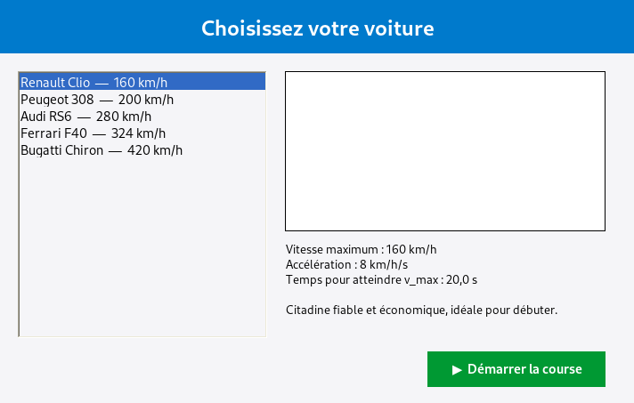
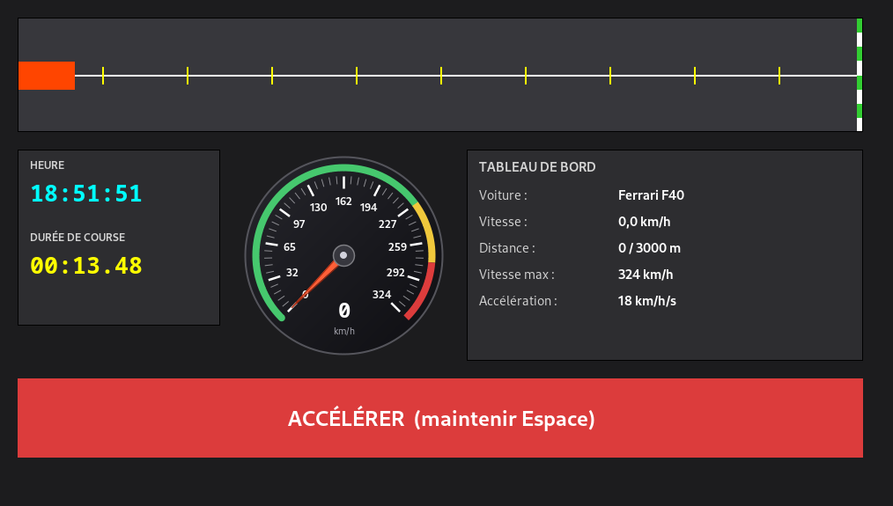

# Course

Jeu de simulation de course de voitures en **C# WinForms**.
Compatible **Windows (.NET 8)** et **Linux (mono)** avec exactement les mêmes sources.

---

## TL;DR - Lancer sous Linux

```bash
sudo apt install mono-complete   # une seule fois
./run-mono.sh                    # compile + lance
```

Maintiens **Espace** pour accélérer. Course de 3 000 m.

---

## Aperçu

### Écran de sélection


### Écran de jeu


---

## Fonctionnalités

- **Sélection** parmi 5 voitures (Renault Clio jusqu'à Bugatti Chiron) chargées depuis `voitures.txt`
- **Course** sur 3 000 m, piste horizontale avec drapeau d'arrivée à damier
- **Compteur de vitesse circulaire** custom (arc de 270 degrés, zones vert/jaune/rouge, aiguille rouge-orange, hub central, affichage numérique)
- **Horloge temps réel** + **chronomètre** de course (`mm:ss.cc`)
- **Tableau de bord live** : vitesse instantanée, distance parcourue, vitesse max, capacité d'accélération
- **Bouton ACCÉLÉRER** + raccourci clavier **Espace** (à maintenir)
- **Physique** conforme au cahier des charges :
  - Accélération constante quand on appuie : `v += capacité * dt`
  - **Aucune décélération** quand on relâche : la vitesse reste figée
  - Plafond automatique à `v_max` de la voiture choisie
- Course chronométrée, dialogue de fin avec récap (temps, distance, vitesse finale)

---

## Lancement

### Sur Linux (via mono)

Prérequis : `mono-complete`

```bash
sudo apt install mono-complete       # Debian/Ubuntu
# ou
sudo dnf install mono-complete       # Fedora
```

Compilation et lancement :

```bash
git clone https://github.com/Mitia-Andriamalala/Course.git
cd Course
./run-mono.sh
```

Le script `run-mono.sh` compile avec `mcs` puis lance avec `mono`. Pour faire les deux étapes manuellement :

```bash
mcs -target:winexe -out:Course/Course.exe \
    -r:System.Windows.Forms.dll \
    -r:System.Drawing.dll \
    Course/Program.cs \
    Course/Models/Voiture.cs \
    Course/Forms/SelectionForm.cs \
    Course/Forms/GameForm.cs \
    Course/Controls/Speedometer.cs

cd Course && mono Course.exe
```

### Sur Windows (.NET 8)

Prérequis : [.NET 8 SDK](https://dotnet.microsoft.com/download/dotnet/8.0)

```bash
git clone https://github.com/Mitia-Andriamalala/Course.git
cd Course
dotnet run --project Course
```

Ou ouvre `Course.sln` directement dans **Visual Studio 2022** et appuie sur F5.

### Build de production

```bash
# Binaire portable .NET 8 (Windows uniquement à l'exécution)
dotnet publish Course -c Release -r win-x64 --self-contained
```

---

## Contrôles

| Action | Touche / Bouton |
|---|---|
| Accélérer | **Espace** (maintenu) ou **bouton rouge** (clic maintenu) |
| Cesser d'accélérer | Relâcher la touche / le bouton (la vitesse **ne diminue pas**) |
| Quitter la course | Fermer la fenêtre |

But : parcourir les **3 000 m** le plus rapidement possible.

---

## Ajouter une voiture

Édite `Course/voitures.txt`. Une voiture par ligne, champs séparés par `|` :

```
Nom|CapaciteAcceleration(km/h/s)|VitesseMax(km/h)|Description|CheminImage
```

Exemple :

```
Lamborghini Aventador|22|350|Supercar italienne avec V12 atmospherique|cars/aventador.png
```

- Les lignes vides et celles commençant par `#` sont ignorées
- `Description` et `CheminImage` sont **optionnels**
- Le séparateur décimal des nombres est le **point** (culture invariante)

---

## Structure du projet

```
Course/
    Course.sln                  Solution Visual Studio
    README.md                   Ce fichier
    run-mono.sh                 Script de build/lancement Linux

    screenshots/                Captures d'écran
        selection.png
        game.png

    Course/
        Course.csproj           Projet .NET 8 + WinForms
        Program.cs              Point d'entrée vers SelectionForm
        voitures.txt            Liste des voitures (data)

        Models/
            Voiture.cs          Classe Voiture + parser de voitures.txt

        Forms/
            SelectionForm.cs    Écran de sélection (liste + aperçu)
            GameForm.cs         Écran de course (piste + HUD + timer)

        Controls/
            Speedometer.cs      Compteur circulaire custom (OnPaint)
```

---

## Architecture technique

### Boucle de jeu

`GameForm` utilise un `System.Windows.Forms.Timer` à **30 ms** (environ 33 fps). Chaque tick :

1. Calcule `dt = maintenant - dernierTick` (temps réel, pas l'intervalle théorique du timer, plus précis)
2. Si `accelere == true` et `vitesse < v_max` : `vitesse += accélération * dt`
3. `position += (vitesse / 3.6) * dt` (conversion km/h vers m/s)
4. Met à jour la position de la voiture sur la piste, le compteur, les labels
5. Si `position >= 3000 m` : fin de course

### Compteur de vitesse (`Speedometer`)

Contrôle WinForms custom (étendu de `Control`) avec rendu manuel dans `OnPaint`.

| Élément | Choix de design |
|---|---|
| Arc | de 135 à 405 degrés (270 d'amplitude), creux en bas |
| Zones | Vert 0-70%, Jaune 70-85%, Rouge 85-100% de v_max |
| Graduations | 11 majeures + 4 mineures entre chaque |
| Aiguille | Triangle rouge-orange `(255,95,55)` avec recul de 10 px (contre-poids) |
| Hub | Cercle gris foncé + point clair central |
| Affichage numérique | 18 pt bold Consolas, dans le creux bas de l'arc |

`DoubleBuffered = true` évite tout scintillement pendant les rafraîchissements.

### Compatibilité multiplateforme

Le code source est volontairement écrit en **C# 7.3 compatible** (namespaces classiques, pas de `Math.Clamp` / `is not` / `new()` / file-scoped namespaces) afin que :

- `dotnet build` (.NET 8 sur Windows) fonctionne avec WinForms natif
- `mcs` + `mono` (Linux) fonctionne avec l'implémentation managée de WinForms via libgdiplus + X11

Le `.csproj` contient `<EnableWindowsTargeting>true</EnableWindowsTargeting>` pour permettre la compilation depuis Linux/macOS (vérification de syntaxe). L'**exécution** native du binaire .NET 8 reste cependant Windows-only.

---

## Licence

Projet personnel et pédagogique. Libre d'utilisation.
